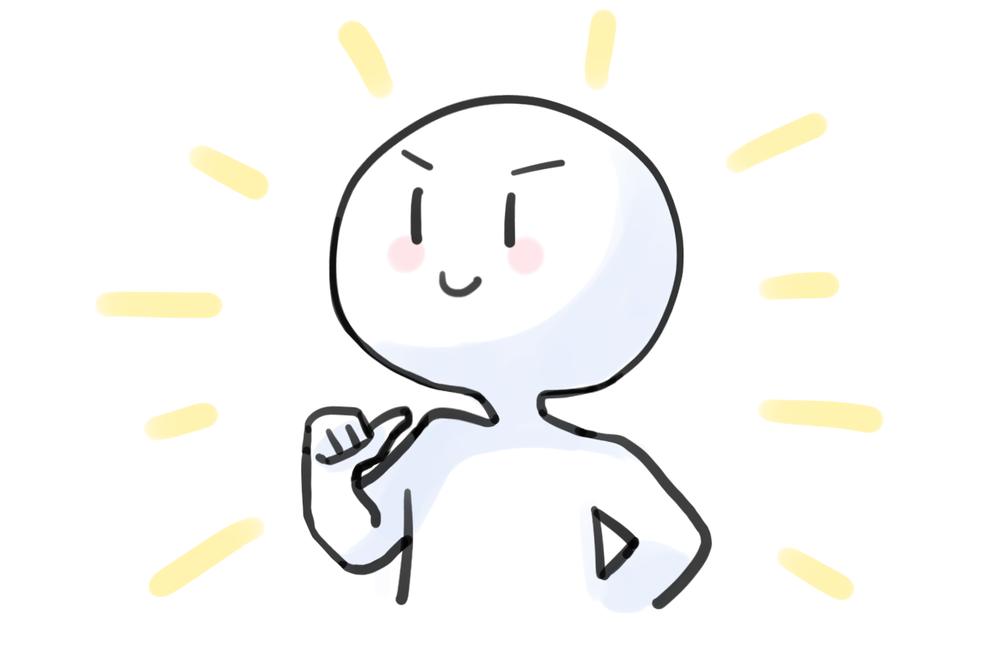
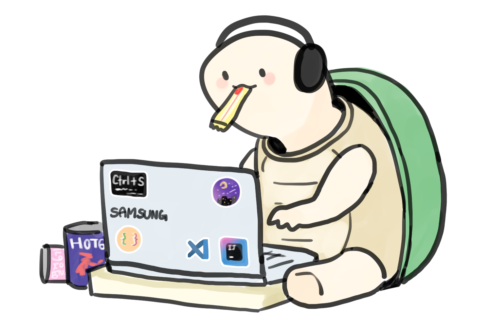
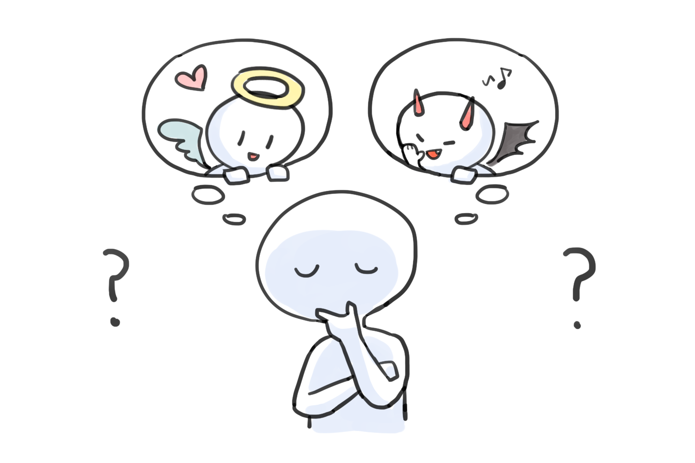
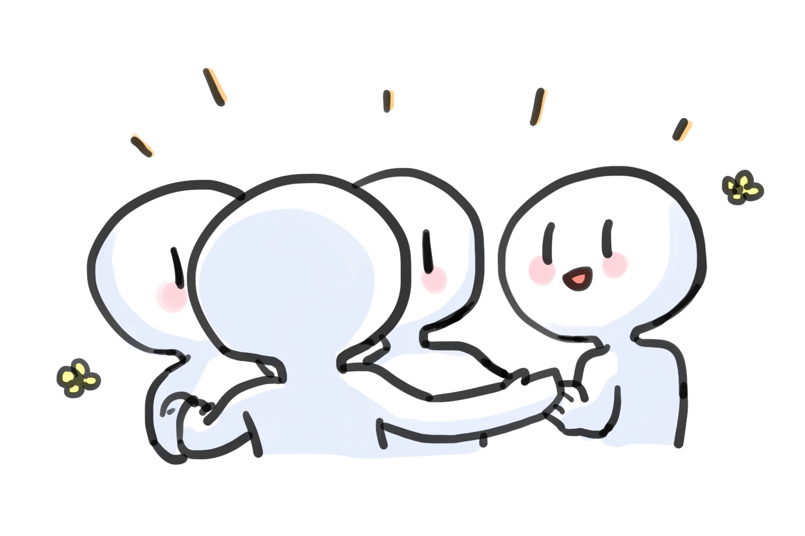
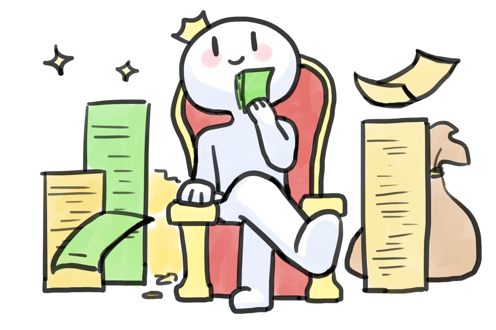

   
  
   
  <h1>당신이 개발자라면</h1>
   

 

## 목차

1. [**웹 서비스 소개**](#1)
1. [**버전 기록**](#2)
1. [**기술 스택**](#3)
1. [**주요 기능**](#4)
1. [**프로젝트 구성도**](#5)
1. [**데모 영상**](#6)
1. [**특이사항**](#7)
1. [**구글 애널리틱스 통계**](#8)
1. [**개발 팀 소개**](#9)
1. [**개발 기간 및 일정**](#10)
1. [**실행 방법**](#11)

 

## 💁 웹 서비스 소개

**'당신이 개발자라면'** 은 2~3만 건의 JetBrain 이 제공한 설문 자료로 학습시킨 인공지능을 통해, 나에게 맞는 개발 분야를 추천해 주는 서비스입니다.

### 서비스 기획 배경

개발자에 대한 관심이 증가하면서, 본인이 어느 분야에 맞는지 잘 모르니 어느 정도 척도를 제공하기 위함입니다.

 

## 💡 주요 기능

### 추천 서비스

나에게 맞는 개발 분야를 추천해주는 서비스

> RNN(Recurrent Neural Network) 모델 사용

### 설문 기반 통계 서비스

설문 기반의 통계 결과를 보여주는 서비스

### 회사 추천 서비스

회사 정보 크롤링하여, 지역입력받아서, 내 위치 기반의 회사 추천 서비스

> 공공데이터 사이트로 크롤링 (주소 → 위도 경도)

### 기타 서비스

- 결과 페이지 내 공유 기능
- 결과지에 댓글 기능 추가
- 익명 커뮤니티
- FAQ

 

## 화면 설계 내용

[화면 기획 노션 페이지](https://www.notion.so/ifyoudev/30740cd7963f4bd7a61499a59fbf37ed)

### 메인 페이지

~를 테스트 하기, 라는 첫 시작 페이지, 검색 엔진 최적화 설계

### 설문 페이지

- 설문 페이지
  - API : 설문 내용 고른 내용 POST → 학습모델 결과 예측 반환
  - 설문 내용 : 구글 스프레드 시트 번역한 것 (20개 이상) + 우리가 정한 6개 질문
  - 구글 스프레드 시트
    - [검사용 설문지 (2)](https://www.notion.so/912dbe447c1643f9ae111a375cc542af)
  - 우리가 정한 6개 질문
    - 성별
    - 연령대
    - 희망 연봉
    - 선호하는 근무 형태(재택근무, 출근)
    - 일할때 즐겨마시는 드링크 (커피, 차, 에너지드링크 등등)
    - ios, android

### 결과 페이지

- API : 설문 내용 결과 GET
- 귀여운 그림으로 알려줄 것
- `당신은 ㅇㅇ분야에 어울립니다` → 1위 2위 3위
- 공유하기
- 분야
  - Websites
  - Utilities
  - Database/Data Storage
  - System Software
  - IT Infrastructure
  - Finance
  - Business Intelligence/ Data Science / Machine Learning
  - Programming Tools
  - Entertainment
  - Games

### 통계 페이지

- API : 통계 결과
- 구글 스프레드 시트 번역한 것 중 6개 + 기본 인적사항
- 통계용 설문

  - 모든 것을 고려했을 때, 요즘 당신의 삶은 얼마나 만족스러운가요?
  - 당신의 직업에 얼마나 만족하나요?
  - 값 비싼 것을 소유하고, 부자가 되는 것을 중요하게 생각하나요?
  - 어떤 위험 요소도 없는 안전한 삶을 사는 것을 중요하게 생각하나요?
  - 다른 사람을 돕는 것을 중요하게 생각하나요?
  - 항상 올바르게 행동하는 것을 중요하게 생각하나요?
  - 연령대
  - 성별
  - 희망 연봉
  - 선호하는 근무 형태(재택근무, 출근)
  - 일할때 즐겨마시는 드링크
  - ios, android

 

## 캐릭터 디자인

### 설문 폼 캐릭터

|  |    |  |  |
| :----------------------------------------------------------------------------------------: | :------------------------------------------------------------------------------------------: | :--------------------------------------------------------------------------------------: | :------------------------------------------------------------------------------------: |
|      |  |    |                                                                                        |

### 설문 결과 캐릭터

|     |      |  |
| :-----------------------------------------------------------------------------------: | :-------------------------------------------------------------------------------------: | :-------------------------------------------------------------------------------------: |
|  |  |       |
|   |     |     |
|    |

 

## 👪 개발 팀 소개

<table>
  <tr>
    <td align="center" width="150px">
      
    </td>
    <td align="center" width="150px">
      
    </td>
    <td align="center" width="150px">
      
    </td>
        <td align="center" width="150px">
      
    </td>
    <td align="center" width="150px">
      
    </td>
    <td align="center" width="150px">
      
    </td>
  </tr>
  <tr>
    <td align="center">
      <a href="https://github.com/JeongHwan-dev" target="_blank">
        박정환 (Front-end)
      </a>
    </td>
    <td align="center">
      <a href="https://github.com/sojjeong" target="_blank">
        소정은 (Front-end)
      </a>
    </td>
    <td align="center">
      <a href="https://github.com/anottrx">
        구련아 (Front-end)
      </a>
    </td>
        <td align="center">
      <a href="https://github.com/DeerGum" target="_blank">
        황정준 (Back-end)
      </a>
    </td>
    <td align="center">
      <a href="https://github.com/dgh03207" target="_blank">
        이아영 (Back-end)
      </a>
    </td>
    <td align="center">
      <a href="https://github.com/person003333" target="_blank">
        이정훈 (Back-end)
      </a>
    </td>
  </tr>
</table>
