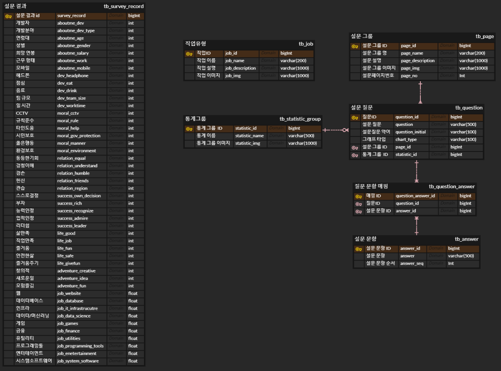

<div align="center">
  <br />
  
  <br />
  <h1>당신이 개발자라면</h1>
  <br />
</div>

<br />

## 목차

1. [**웹 서비스 소개**](#1)
1. [**기술 스택**](#2)
1. [**주요 기능**](#3)
1. [**화면 설계 내용**](#4)
1. [**프로젝트 구성도**](#5)
1. [**캐릭터 디자인**](#6)
1. [**API 명세**](#7)
1. [**개발 팀 소개**](#8)
1. [**Git 규칙**](#9)

<br />

<div id="1"></div>

## 💁 웹 서비스 소개

**'당신이 개발자라면'** 은 2~3만 건의 JetBrain 이 제공한 설문 자료로 학습시킨 인공지능을 통해, 나에게 맞는 개발 분야를 추천해 주는 서비스입니다.

### 서비스 기획 배경

개발자에 대한 관심이 증가하면서, 본인이 어느 분야에 맞는지 잘 모르니 어느 정도 척도를 제공하기 위함입니다.

### 서비스 노션

[🔗 서비스 노션 링크](https://ifyoudev.notion.site/13054c90526f473ab2217b0842c5e4d0) 👈

### GitLab Repo

[**🔗 프론트엔드 저장소 바로가기 Click !**](https://lab.ssafy.com/jeonghwan9405/s06p22a205-frontend) 👈

[**🔗 백엔드 저장소 바로가기 Click !**](https://lab.ssafy.com/s06-bigdata-rec-sub2/S06P22A205) 👈

<br />

<div id="2"></div>

## 🛠 기술 스택

### **Front-end**

|  |  |  |
| :----------------------------------------------------------------------------------------------------------------------------: | :--------------------------------------------------------------------------------------------------------------------------: | :-----------------------------------------------------------------------------------------------------------------------------: |
|                                                             HTML5                                                              |                                                             CSS3                                                             |                                                           TypeScript                                                            |

|  |  |  |  |
| :-------------------------------------------------------------------------------------------------------------------------------: | :-------------------------------------------------------------------------------------------------------------------: | :------------------------------------------------------------------------------------------------------------: | :------------------------------------------------------------------------------------------------------------------------------------------------------------------: |
|                                                               React                                                               |                                                         Redux                                                         |                                                   Redux-Saga                                                   |                                                                             React-Query                                                                              |

|  |  |  |
| :--------------------------------------------------------------------------------------------------------------------------: | :--------------------------------------------------------------------------------: | :-------------------------------------------------------------------------------------------------------------------------: |
|                                                           Emotion                                                            |                                        MUI                                         |                                                     Mock Service Worker                                                     |

### **Back-end**

|  |  |  |  |  |
| :--------------------------------------------------------------------------------------------------------------------------: | :---------------------------------------------------------------------------------------------------------------------------------------------: | :------------------------------------------------------------------------------------------------------------------------------------------------------------------: | :----------------------------------------------------------------------------------------------------------------------------: | :-----------------------------------------------------------------------------------------------------------------------------------------------------: |
|                                                             Java                                                             |                                                                   Spring-Boot                                                                   |                                                                              Hibernate                                                                               |                                                             MySQL                                                              |                                                                          JUnit                                                                          |

|  |  |
| :--------------------------------------------------------------------------------------------------------------------------------------------------------------------------------------------------: | :-------------------------------------------------------------------------------------------------------------------------: |
|                                                                                               Postman                                                                                                |                                                           Swagger                                                           |

### **DevOps**

|  |  |  |  |
| :-------------------------------------------------------------------------------------------------------------------: | :------------------------------------------------------------------------------------------------------------------------------: | :-----------------------------------------------------------------------------------------------------------------------------------------------------------: | :------------------------------------------------------------------------------------------------------------------------------: |
|                                                         NGINX                                                         |                                                               aws                                                                |                                                                            Jenkins                                                                            |                                                              docker                                                              |

### **서비스 구성도**


<br />

<div id="3"></div>

## 💡 주요 기능

### 추천 서비스

나에게 맞는 개발 분야를 추천해주는 서비스

> RNN(Recurrent Neural Network) 모델 사용

### 설문 기반 통계 서비스

설문 기반의 통계 결과를 보여주는 서비스

### 기타 서비스

- 결과 페이지 내 공유 기능

<br />

<div id="4"></div>

## 💻 화면 설계 내용

[🔗 화면 기획 노션 페이지 링크](https://ifyoudev.notion.site/30740cd7963f4bd7a61499a59fbf37ed) 👈

### 메인 페이지

~를 테스트 하기, 라는 첫 시작 페이지, 검색 엔진 최적화 설계

### 설문 페이지

- 설문 페이지
  - API : 설문 내용 고른 내용 POST → 학습모델 결과 예측 반환
  - 설문 내용 : 구글 스프레드 시트 번역한 것 (20개 이상) + 우리가 정한 질문 몇 가지
  - 구글 스프레드 시트
    - [검사용 설문지](https://www.notion.so/912dbe447c1643f9ae111a375cc542af)
  - 우리가 정한 질문
    - 현직에서 개발일을 하고 계신가요?
    - 현재 일하고 있는 분야를 선택해주세요.
    - 연령대를 선택해주세요.
    - 성별을 선택해주세요.
    - 희망 연봉은 얼마인가요?
    - 선호하는 근무형태는 무엇인가요?
    - 사용하는 모바일 운영체제는 무엇인가요?

### 결과 페이지

- API : 설문 내용 결과 GET
- 귀여운 그림으로 알려줄 것
- `당신은 ㅇㅇ분야에 어울립니다` → 1위 2위 3위
- 공유하기
- 분야
  - Websites (웹)
  - Utilities (응용소프트웨어)
  - Database/Data Storage (DB)
  - System Software (시스템소프트웨어)
  - IT Infrastructure (인프라)
  - Finance (금융)
  - Business Intelligence/ Data Science / Machine Learning (데이터/머신러닝)
  - Programming Tools (프로그래밍툴)
  - Entertainment (엔터테인먼트)
  - Games (게임)

### 통계 페이지

- API : 통계 결과
- 기본 인적사항 + 구글 스프레드 시트 번역한 것 흥미로운 질문 몇 가지
- 통계용 설문

  - 현직에서 개발일을 하고 계신가요?
  - 현재 일하고 있는 분야를 선택해주세요.
  - 연령대를 선택해주세요.
  - 성별을 선택해주세요.
  - 희망 연봉은 얼마인가요?
  - 당신의 직업에 얼마나 만족하나요?
  - 선호하는 근무형태는 무엇인가요?
  - 사용하는 모바일 운영체제는 무엇인가요?
  - 일 할 때 어떤 음료를 마시나요?
  - 다른 사람을 돕는 것을 중요하게 생각하나요?
  - 항상 올바르게 행동하는 것을 중요하게 생각하나요?
  - 값 비싼 것을 소유하고, 부자가 되는 것을 중요하게 생각하나요?
  - 모든 것을 고려했을 때, 요즘 당신의 삶은 얼마나 만족스러운가요?
  - 어떤 위험 요소도 없는 안전한 삶을 사는 것을 중요하게 생각하나요?

<br />

<div id="5"></div>

## 📂 프로젝트 구성도

| [Figma](https://www.figma.com/file/rQIr2T42ioEPhIBGi90Tch/If-you-developer) |
| :-------------------------------------------------------------------------: |
|                            |

|                      ERD                      |
| :-------------------------------------------: |
|  |

<br />

<div id="6"></div>

## 🐱 캐릭터 디자인

### 설문 폼 캐릭터

|  |   |   |  |
| :-------------------------------------------------------------------------------------------------: | :--------------------------------------------------------------------------------------------: | :-----------------------------------------------------------------------------------------: | :--------------------------------------------------------------------------------------------: |
|            |  |  |                                                                                                |

### 설문 결과 캐릭터

|     |      |  |
| :-----------------------------------------------------------------------------------: | :-------------------------------------------------------------------------------------: | :-------------------------------------------------------------------------------------: |
|  |  |       |
|   |     |     |
|    |

<br />

<div id="7"></div>

## 📋 API 명세

[🔗 API 명세 문서 링크](https://ifyoudev.notion.site/API-b9a2523dfcb54d508f10d97aa63fb6c3) 👈

<br />

<div id="8"></div>

## 👪 개발 팀 소개

<table>
  <tr>
    <td align="center" width="150px">
      <a href="https://github.com/JeongHwan-dev" target="_blank">
        
      </a>
    </td>
    <td align="center" width="150px">
      <a href="https://github.com/sojjeong" target="_blank">
        
      </a>
    </td>
    <td align="center" width="150px">
      <a href="https://github.com/anottrx" target="_blank">
        
      </a>
    </td>
        <td align="center" width="150px">
      <a href="https://github.com/DeerGum" target="_blank">
        
      </a>
    </td>
    <td align="center" width="150px">
      <a href="https://github.com/dgh03207" target="_blank">
        
      </a>
    </td>
    <td align="center" width="150px">
      <a href="https://github.com/person003333" target="_blank">
        
      </a>
    </td>
  </tr>
  <tr>
    <td align="center">
      <a href="https://github.com/JeongHwan-dev" target="_blank">
        박정환<br />(Front-end)
      </a>
    </td>
    <td align="center">
      <a href="https://github.com/sojjeong" target="_blank">
        소정은<br />(Front-end)
      </a>
    </td>
    <td align="center">
      <a href="https://github.com/anottrx">
        구련아<br />(Front-end)
      </a>
    </td>
        <td align="center">
      <a href="https://github.com/DeerGum" target="_blank">
        황정준<br />(Back-end)
      </a>
    </td>
    <td align="center">
      <a href="https://github.com/dgh03207" target="_blank">
        이아영<br />(Back-end)
      </a>
    </td>
    <td align="center">
      <a href="https://github.com/person003333" target="_blank">
        이정훈<br />(Back-end)
      </a>
    </td>
  </tr>
</table>

<br />

<div id="9"></div>

## 📌 Git 규칙

### Git Convention

```
Feat : 새로운 기능을 추가할 경우
Fix : 버그를 고친 경우
Hotfix : 급하게 치명적인 버그를 고쳐야하는 경우
Design : CSS 등 사용자 UI 디자인 변경
Style : 코드 포맷 변경, 세미 콜론 누락, 코드 수정이 없는 경우
Modify : 단순한 코드 수정
Delete : 삭제한 코드 설명
Remove : 파일을 삭제하는 작업만 수행한 경우
Comment: 필요한 주석 추가 및 변경
Docs : 문서를 수정한 경우
Test : 테스트 추가, 테스트 리팩토링(프로덕션 코드 변경 X)
Chore : 빌드 태스트 업데이트, 패키지 매니저를 설정하는 경우(프로덕션 코드 변경 X)
Refactor : 코드 리팩토링 경우
Rename : 파일 혹은 폴더명을 수정하거나 옮기는 작업만인 경우
Merge : to ← from (#1)
Merge : 변경된 내용 작성
```

> Tag : 커밋 내용에 대한 설명

> 커밋 내용에 대한 설명은 간결하면서도 그 설명만 보고도 어떠한 커밋인지 추측할 수 있을 정도로 작성

### 예시

```
Feat : 로그인 API 구현
Design : 00 통계 차트 마크업 및 스타일링 구현
Refactor : 회원가입 API 코드 리팩터링
Merge : develop ← feature/login
Remove : 땡땡땡 파일 삭제
```

### 브랜치 전략

```
master : 제품으로 출시될 수 있는 브랜치
develop : 다음 출시 버전을 개발하는 브랜치
feature : 기능을 개발하는 브랜치
release : 이번 출시 버전을 준비하는 브랜치
hotfix : 출시 버전에서 발생한 버그를 수정 하는 브랜치
```

### 예시

```
master

release-1.0.0

develop

feature/login
feature/signup
```
